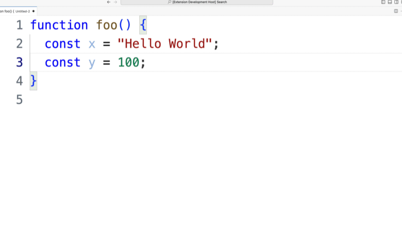

# Nanoid Snippets

Inserting nanoids at your cursor is very powerful and like other extensions this is supported.

However, it's even more powerful to create some snippets for common logging/error patterns that automatically insert a nanoid. This saves hours of debugging and tracing down the origin of logs/errors. A few common use cases when this is useful.

* No more wondering where some random log is coming from. How many hours have devs wasted trying to fine an annoying `console.log` that keeps outputting some variable? With the nanoid you can always find the origin of a log and squash it if desired.
* By inserting it into errors you can actually find where in the code the error originated from. Sourcemaps are a great idea in theory but often are broken and make them worthless in tracking down the origin of an error, hence a unique, searchable string is far more useful.

Here are some common snippets. The examples are in javascript but can be adjusted for any language.

* `__NANOID__` - Insert a nanoid at cursor
* `__HOURS_MINUTES_SECONDS__` - Extra keyword to insert the current hour and seconds. Useful when you want to drop a bunch of logs that are somewhat sequencial
* `new Error('$1 __NANOID__')` - Create an error with a nanoid
* `console.log($1,'__NANOID__')` - Create a log with a nanoid


## Demo



## Configuration

Nanoid will be inserted on the fly when the string `__NANOID__` appears in your snippet. There are 10 snippet slots. You must bind them to a keyboard shortcut to use them.

settings.json
```json
{
    "nanoid-snippets.snip0": "__NANOID__",
    "nanoid-snippets.snip1": "console.log($1,'__NANOID__')",
    "nanoid-snippets.snip2": "new Error('$1 __NANOID__')",
    "...": "...",
    "nanoid-snippets.snip9": "...",
}
```

keybindings.json
```json
{
    "key": "cmd+i",
    "command": "nanoid-snippets.insert-snip0"
  },
  {
    "...":"...."
  },
  {
    "key": "...",
    "command": "nanoid-snippets.insert-snip9"
  },
```

## Limitations

* When using multiple cursors it currently does not support a unique nanoid each cursor. A PR is welcome if someone wants to add it. Send me an email at kevin[dot]m[dot]ashton[at]gmail[dot]com if you do though. I disable most notifications from things like Github, too much noise in life already.

